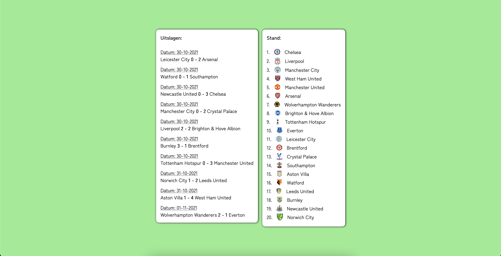

# Repo naam

Welkom bij mijn project van functional programming.
BESCHRIJVING

De website is [hier](#LINK HIER) te zien.

### Installatie

Om de app lokaal te laten draaien moet het project eerst lokaal worden gecloned.
Als dit stukje code gerunt wordt in de terminal wordt de repository lokaal gecloned:

`gh repo clone tomvandenberg11/functional-programming.git`

Ga eerst naar de folder waarin je wilt dat het project gecloned wordt. Je kan in de terminal navigeren met `cd` met daar achter de map waar je heen wilt.

Daarna is het nodig om `node` en `npm` geinstalleerd te hebben op je lokale computer. Als je deze stappen gevolgd hebt, worden met `npm install` de benodigde packages gedownload.

### Running
Als je de bovenstaande stappen gevolgd hebt kan de app opgestart worden door:

`npm run server`

te runnen in de terminal.
Je ziet dan een bericht in de terminal staan op welke link de app te zien is.

## Rubrics

## Licence
Dit project is voorzien van een MIT licence. Zie de pagina LICENCE voor meer informatie.

## Credits
